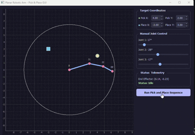
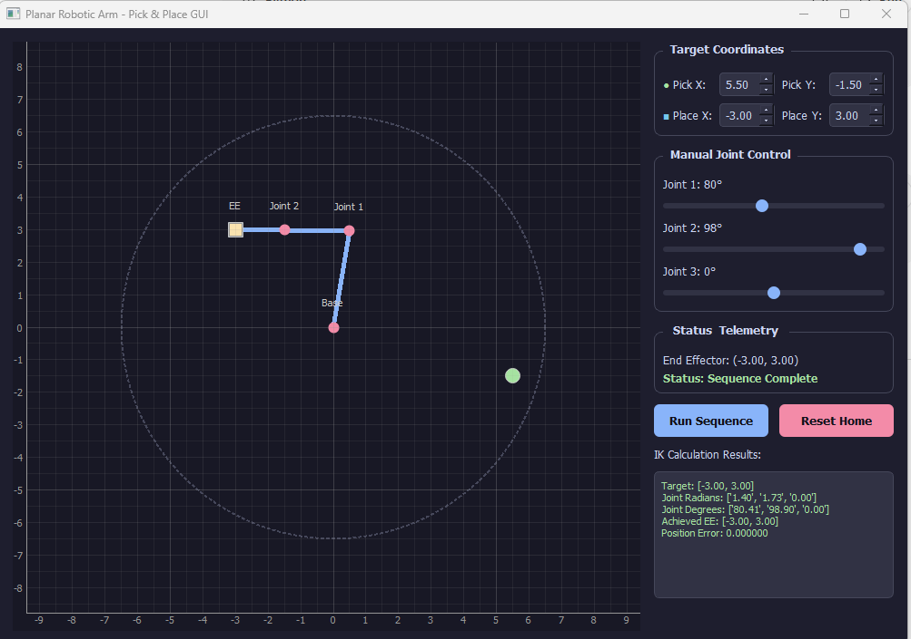

# 🤖 Planar Robotic Arm Simulation

A 3-DOF planar robotic arm simulation with **Damped Least-Squares (DLS) Jacobian-based Inverse Kinematics**, joint limits, workspace visualization, and an interactive **PyQt5 + PyQtGraph** GUI for pick-and-place motion.

The project demonstrates fundamental robotic manipulation concepts including **forward kinematics, inverse kinematics, numerical Jacobians, damped least-squares IK, joint constraints, trajectory interpolation, workspace analysis, and interactive robot control**.

<div align="center">

</div>


---

## 📌 Project Overview

This project implements a simplified 3-DOF planar robotic arm as a stand-in for a real robotic manipulator.

The user can:

- Manually control individual joints using GUI sliders
- Specify custom pick and place positions
- Calculate joint angles using Jacobian-based inverse kinematics
- Automatically perform a pick-and-place operation
- Visualize the robot's end-effector position
- Visualize the reachable workspace
- Enforce joint-angle limits
- Stop automatic motion and switch to manual control at any time

<div align="center">

</div>


---

## 🦾 Robot Configuration

The simulated robot has three revolute joints with the following link lengths:

```text
Link 1 = 3.0 units
Link 2 = 2.0 units
Link 3 = 1.5 units
```

The theoretical maximum arm length is:

```text
3.0 + 2.0 + 1.5 = 6.5 units
```

### Joint Limits

| Joint | Minimum | Maximum |
|------|--------:|--------:|
| Joint 1 | -180° | 180° |
| Joint 2 | -120° | 120° |
| Joint 3 | -120° | 120° |

The workspace visualization takes these joint constraints into consideration rather than displaying a simple complete circle.

---

# 🧮 Forward Kinematics

Forward kinematics calculates the position of the end effector from the joint angles.

For the 3-link planar arm:

```text
x = L₁ cos(q₁)
  + L₂ cos(q₁ + q₂)
  + L₃ cos(q₁ + q₂ + q₃)

y = L₁ sin(q₁)
  + L₂ sin(q₁ + q₂)
  + L₃ sin(q₁ + q₂ + q₃)
```

where:

- `L₁, L₂, L₃` are the link lengths
- `q₁, q₂, q₃` are the joint angles
- `(x, y)` is the end-effector position

The forward kinematics function also provides the positions of the intermediate joints, allowing the GUI to draw the complete arm.

---

# 🔄 Inverse Kinematics

The project uses an **iterative Jacobian-based Damped Least-Squares (DLS) inverse kinematics method**.

Given a desired end-effector position:

```text
(x_target, y_target)
```

the algorithm attempts to find joint angles:

```text
(q₁, q₂, q₃)
```

that bring the end effector to the target.

### IK Process

```text
Target Position
      │
      ▼
Current Joint Configuration
      │
      ▼
Forward Kinematics
      │
      ▼
Current End-Effector Position
      │
      ▼
Calculate Cartesian Error
      │
      ▼
Calculate Numerical Jacobian
      │
      ▼
Damped Least-Squares Calculation
      │
      ▼
Calculate Joint Update
      │
      ▼
Apply Joint Limits / Constraints
      │
      ▼
Update Joint Angles
      │
      ▼
Repeat Until Target Reached
```

The Cartesian error is calculated as:

```text
e = target_position - current_position
```

The iterative process continues until the position error falls below the specified tolerance or the maximum number of iterations is reached.

---

# 📐 Numerical Jacobian

The Jacobian describes how small changes in joint angles affect the end-effector position.

For the 3-DOF planar arm:

```text
        ┌                         ┐
        │ ∂x/∂q₁  ∂x/∂q₂  ∂x/∂q₃ │
J =     │                         │
        │ ∂y/∂q₁  ∂y/∂q₂  ∂y/∂q₃ │
        └                         ┘
```

The Jacobian therefore has dimensions:

```text
2 × 3
```

Each column represents the effect of one joint on the end-effector's x and y position.

The Jacobian is calculated numerically using finite differences.

For a small joint perturbation:

```text
∂position/∂qᵢ ≈
(position_after - position_before) / Δq
```

This avoids requiring a manually derived analytical Jacobian.

---

# 🛡️ Damped Least-Squares IK

Instead of directly calculating a Jacobian inverse, the project uses the **Damped Least-Squares (DLS)** formulation.

The joint update is calculated using:

```text
Δq = Jᵀ (J Jᵀ + λ²I)⁻¹ e
```

where:

- `J` = Jacobian matrix
- `Jᵀ` = Jacobian transpose
- `e` = Cartesian position error
- `λ` = damping factor
- `I` = identity matrix
- `Δq` = change in joint angles

### Why Damping?

Robotic manipulators can encounter **singular or near-singular configurations** where small Cartesian movements may require very large joint movements.

Damping improves numerical stability in these situations.

Conceptually:

```text
Normal Jacobian IK
       │
       ▼
Near singularity
       │
       ▼
Very large joint update
       │
       ▼
Unstable motion
```

With damping:

```text
Near singularity
       │
       ▼
Damping term
       │
       ▼
Limited / stabilized joint update
       │
       ▼
More stable IK
```

The damping factor therefore provides a trade-off between precise tracking and numerical stability.

---

# 🎯 Multiple IK Solutions

For a given end-effector position, a robotic arm can potentially have multiple valid joint configurations.

The implementation considers possible configurations and evaluates them against the current robot state and constraints.

The preferred solution is the one that provides a suitable target position while minimizing unnecessary joint movement from the current configuration.

This helps avoid abrupt or undesirable configurations.

---

# 🎯 Pick and Place

The GUI allows the user to specify custom pick and place coordinates.

The pick-and-place sequence is:

```text
              PICK
                │
                ▼
        Calculate IK
                │
                ▼
        Move to Pick
                │
                ▼
          Grab Object
                │
                ▼
        Calculate IK
                │
                ▼
        Move to Place
                │
                ▼
         Release Object
```

---

# 🖥️ GUI

The graphical interface is implemented using:

- **PyQt5** for the GUI
- **PyQtGraph** for real-time visualization
- **NumPy** for numerical calculations

### GUI Features

- Interactive joint sliders
- Pick X/Y position controls
- Place X/Y position controls
- End-effector position display
- Labels for Joints, Base, Ende Effector
- Robot visualization
- Reachable workspace visualization
- Moving object visualization
- Robot status display
- Automatic pick-and-place button
- Reset position button
- Joints in rad/deg and error values printed

---

# ⚡ Responsive GUI and Motion Control

The animation uses a **Qt `QTimer`** rather than a blocking loop with `time.sleep()`.

The robot motion is divided into small incremental updates.

Because the main GUI thread is not blocked by a long-running loop, the window remains responsive during robot motion.

---

## 🕹️ Manual Override

The user can grab any joint slider while the robot is performing automatic motion.

When a slider is pressed:

```text
Automatic Motion
       │
       ▼
User presses slider
       │
       ▼
Stop QTimer
       │
       ▼
Cancel automatic sequence
       │
       ▼
Manual control
```

This allows the operator to immediately interrupt the automatic pick-and-place operation.

---

# ⚙️ Installation

## 1. Clone the repository

```bash
git clone https://github.com/PukyBots/jacobian-ik-robot-arm-simulation-gui
```

```bash
cd jacobian-ik-robot-arm-simulation-gui
```

## 2. Create a virtual environment

Windows:

```bash
py -m venv venv
```

Activate the environment:

```bash
.\venv\Scripts\activate
```

## 3. Install dependencies

```bash
pip install -r requirements.txt
```

---

# ▶️ Running the Simulation

Run:

```bash
python gui_app_updated.py
```

The PyQt5 GUI will open with the simulated robotic arm.

---

## Pick and Place

1. Enter the desired Pick X/Y position.
2. Enter the desired Place X/Y position.
3. Press **Run Pick & Place**.
4. The IK solver calculates a suitable configuration for the Pick position.
5. The arm moves smoothly to the Pick position.
6. The object is picked.
7. The IK solver calculates a configuration for the Place position.
8. The arm moves to the Place position.
9. The object is released.

---

## Manual Interruption

During automatic motion, grab any joint slider.

The automatic sequence is stopped and manual control is returned to the user.

---

# 🚀 Future Improvements

The current project is a simplified 2D representation of a robotic manipulator.

Possible extensions include:

- 3D robotic arm simulation
- Full 6-DOF kinematics
- Analytical IK
- Improved Damped Least-Squares IK
- Adaptive damping
- Collision detection
- Obstacle avoidance
- Velocity constraints
- Acceleration constraints
- Joint velocity limits
- Cartesian trajectory planning
- Joint-space trajectory planning
- ROS2 integration
- Gazebo simulation
- RViz visualization
- MoveIt integration
- Real robotic arm control

---

# 🤖 Extension to a Real 6-DOF ROS2 Robot

This project is designed as a simplified stand-in for a real robotic manipulator.

The fundamental robotics concepts would remain the same:

```text
Forward Kinematics
Inverse Kinematics
Jacobians
Joint Limits
Trajectory Generation
```

However, the system would move from a standalone 2D application to a ROS2-based architecture.

A possible architecture would be:

```text
                  Target Pose
                      │
                      ▼
              IK / Motion Planner
                      │
                      ▼
                Joint Trajectory
                      │
                      ▼
                ROS2 Controller
                   /       \
                  /         \
                 ▼           ▼
              Gazebo      Real Robot
                 │
                 ▼
                RViz
```

---

## From 2D to 3D

The current project solves for:

```text
x
y
```

A 6-DOF robot would generally require a full Cartesian pose:

```text
Position:
x, y, z

Orientation:
roll, pitch, yaw
```

The Jacobian would therefore relate joint velocities to both linear and angular end-effector velocities.

For a typical 6-DOF manipulator:

```text
6 × 6 Jacobian
```

The same Jacobian-based IK concept can therefore be extended to a higher-dimensional robotic system.

---

## ROS2 / Gazebo / RViz Architecture

For a real or simulated robot, the standalone GUI would be replaced or complemented by ROS2 components.

A typical flow would be:

```text
Target Pose
    │
    ▼
IK / Motion Planning
    │
    ▼
Joint Trajectory
    │
    ▼
ROS2 Controller
    │
    ▼
Gazebo / Real Robot
    │
    ▼
Joint States
    │
    ▼
RViz
```

Gazebo would provide simulation of:

- Robot dynamics
- Gravity
- Joint behavior
- Collisions
- Inertia
- Friction
- Sensors

RViz would provide visualization of:

- Robot model
- TF frames
- Joint states
- Planned trajectories
- End-effector pose
- Environment

For a production robotic system, additional considerations would include collision checking, trajectory planning, velocity/acceleration limits, singularity handling, and real-time control.

---

# 📚 Concepts Demonstrated

This project demonstrates practical implementation of:

- Forward Kinematics
- Inverse Kinematics
- Numerical Jacobians
- Finite Difference Methods
- Damped Least-Squares IK
- Cartesian Position Error
- Iterative Optimization
- Joint Limits
- Workspace Analysis
- Joint-Space Motion
- Cartesian-Space Targets
- Trajectory Interpolation
- Pick-and-Place Manipulation
- Event-Driven GUI Programming
- Real-Time Visualization
- Manual Motion Override

---

# 👨‍💻 Author

**Pulkit Garg**

Robotics & Intelligent Transport  
Robotics | ROS2 | Computer Vision | Autonomous Systems

---

# ⭐ Project Goal

The goal of this project is to demonstrate how fundamental robotic kinematics and motion-control concepts can be implemented in a simple 2D environment and subsequently extended to a real 6-DOF robotic system using **ROS2, Gazebo, and RViz**.